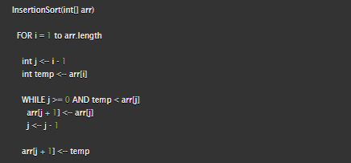

# Insertion Sort

Insertion Sort is a sorting algorithm which builds a sorted array, given an array.

# Pseudocode

# Trace
Sample Array: [8,4,23,42,16,15]

## Pass 1:

In the first pass through of the insertion sort, we evaluate if there is 

## Pass 2:

In the first pass through of the insertion sort, we evaluate if there is

## Pass 3:

In the first pass through of the insertion sort, we evaluate if there is

## Pass 4:

In the first pass through of the insertion sort, we evaluate if there is

## Pass 5:

In the first pass through of the insertion sort, we evaluate if there is

## Pass 6:

In the first pass through of the insertion sort, we evaluate if there is

