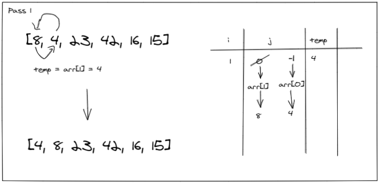
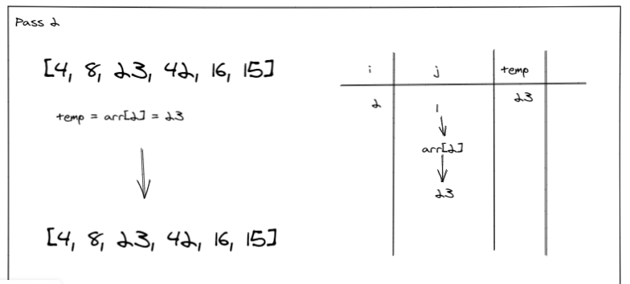
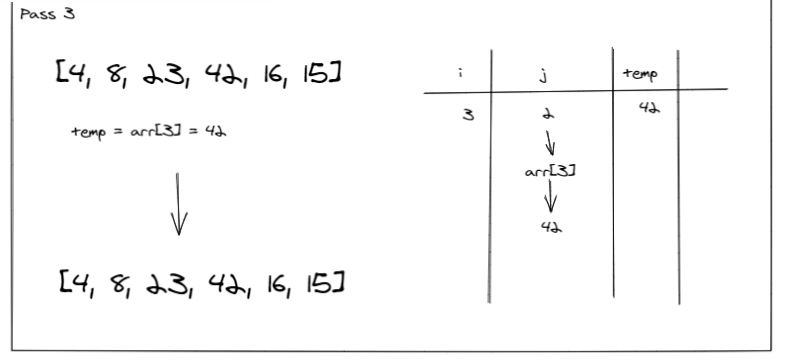
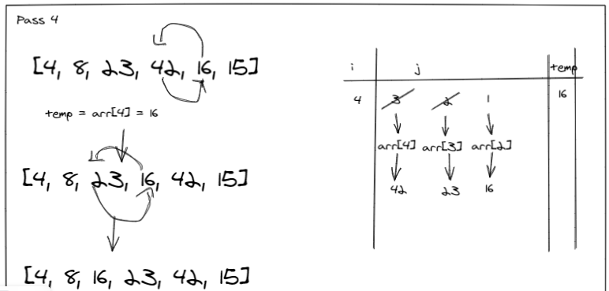
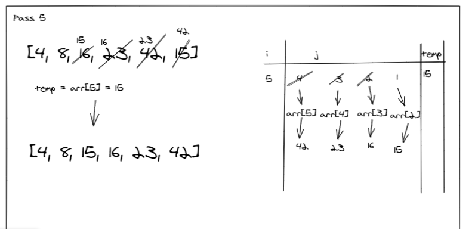

# Insertion Sort

Insertion Sort is a sorting algorithm which builds a sorted array, given an array.

# Pseudocode

# Trace
Sample Array: [8,4,23,42,16,15]

## Pass 1:

In the first pass through of the insertion sort, we assign the array element at index 1 to a temporary variable. We check if the first element is larger than temp element we swap values. Such that first element becomes second elemnt and vice versa.

## Pass 2:

In the second pass through of the insertion sort, we assign the array element at index 2 to a temporary variable. We check if the second element is larger than temp. But the condition fails, array remains the same.

## Pass 3:

In the third pass through of the insertion sort, we assign the array element at index 3 to a temporary variable. We check if the third element is larger than temp. But the condition fails, array remains the same.

## Pass 4:

In the fourth pass through of the insertion sort, we assign the array element at index 4 to a temporary variable. We check if the fourth element is larger than temp. we swap values. Such that fifth element becomes fourth elemnt and vice versa. Then we check if the third element is larger than temp. we swap values. Such that fourth element becomes third elemnt and vice versa.

## Pass 5:

In the fifth pass through of the insertion sort,  we assign the array element at index 5 to a temporary variable. We check if the fifth element is larger than temp. we re-assign sixth element to value of fifth element. We check again if the fourth element is larger than temp. we re-assign fifth element to value of fourth element.  We check again if the third element is larger than temp. we re-assign fourth element to value of third element. Then the second element is less than temp, so we re-assign third element to temp value.

# Efficency

- Time: O(n^2)
  - The basic operation of this algorithm is comparison in case of worst case. In case of swaps, O(n)

- Space: O(1)
  - only a temp variable is being used. Space is constant, does not depend on array size.
