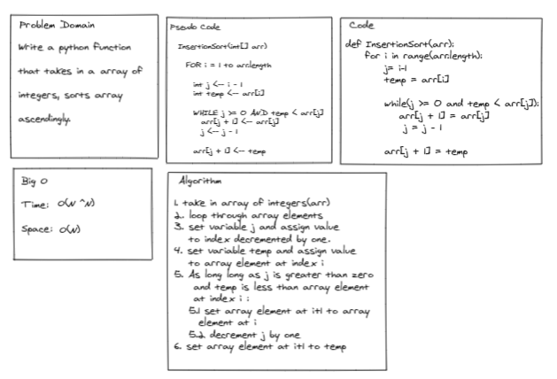

# Challenge Summary
Write a python function that takes in a array of integers, sorts array ascendingly.

## Whiteboard Process

## Approach & Efficiency
Time Complexity: O(N^2)
Space Complexity: O(N)

